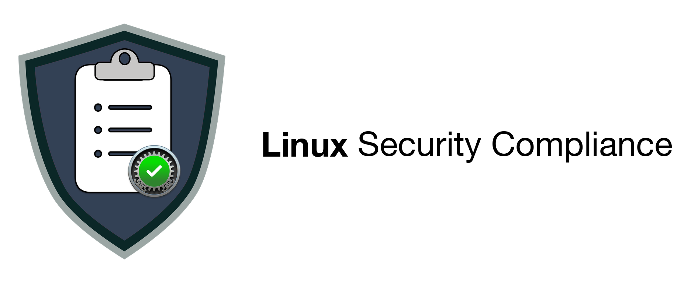

  <picture>
    <source media="(prefers-color-scheme: dark)" srcset="lscp/data/images/lscp_readme_banner_dark.png">
    <source media="(prefers-color-scheme: light)" srcset="lscp/data/images/lscp_readme_banner.png">
    
  </picture>

  
  
  

The Linux Security Compliance Project (LSCP) is an [open-source](LICENSE)
project that helps organizations secure their Linux systems. You choose the
security rules to enforce, and LSCP generates everything you need:

- **Compliance scripts** to verify the rules on a system
- **Fix scripts** to enforce the rules a system fails
- **Documentation** describing each rule, its rationale, and the controls it
  maps to, ready to drop into an audit or authorization package
- **Baselines** to collect the rules into a single definition of compliant

Beyond the built-in frameworks, organizations can build customized baselines to
meet their specific cybersecurity needs. Vendors can also use LSCP as a source
to build manifests, datapoints, and other compliance content for their
products.

The security rules are derived from NIST Special Publication (SP) 800-53,
_Security and Privacy Controls for Information Systems and Organizations_,
Revision 5. LSCP is a project of federal IT security staff from the National
Institute of Standards and Technology (NIST), along with a community of
contributors who test the project and provide feedback to keep it on the
cutting edge of Linux security.

LSCP brings to Linux the approach proven by the [macOS Security Compliance
Project](https://github.com/usnistgov/macos_security) (mSCP), the technical
implementation of NIST SP 800-219 (Rev. 2), [_Automated Secure Configuration
Guidance from the macOS Security Compliance
Project_](https://csrc.nist.gov/pubs/sp/800/219/r2/final).

If you would like to contribute, see the [contributor guidance](CONTRIBUTING.md).

## Supported Platforms

|Distribution|Versions Supported|Release Type|
|--------------------|---------------------|--------------------------|
|| |Long Term Support (LTS) releases only|

## Supported Frameworks

|Country of Origin|Framework Name|OS Supported|
|--------------------|---------------------|--------------------------|
||DISA STIG| |

Don't see your framework listed? Reach out through the [contributor
guidance](CONTRIBUTING.md) or open an
[issue](https://github.com/usnistgov/linux_security/issues/new) to find out how
we can get it included.

## Usage

Civilian agencies are to use the National Checklist Program as required by
[NIST 800-70](https://csrc.nist.gov/pubs/sp/800/70/r5/final).

> [!NOTE]
> Part 39 of the Federal Acquisition Regulations, section 39.101 paragraph (c)
> states, “In acquiring information technology, agencies shall include the
> appropriate information technology security policies and requirements,
> including use of common security configurations available from the National
> Institute of Standards and Technology’s website at https://checklists.nist.gov.
> Agency contracting officers should consult with the requiring official to
> ensure the appropriate standards are incorporated.”

## Authors

| Name | Organization |
|------|--------------|
| Amy Colvin | NIST |
| Bob Gendler | NIST |
| R. Allen Wilkinson | NIST |
| Zachary Amoss | NIST |

## NIST Disclaimer

Any identification of commercial or open-source software in this document is
done so purely in order to specify the methodology adequately. Such
identification is not intended to imply recommendation or endorsement by the
National Institute of Standards and Technology, nor is it intended to imply that
the software identified are necessarily the best available for the purpose.
